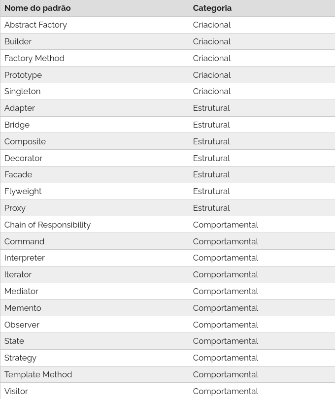

# PAP (Padrões de Projeto)

## Resume
Padrões de projeto são soluções típicas para problemas comuns em projeto de software.

### Categoria
- Padrões de Criação: Tem como objetivo abstrair a instanciação de objetos. Com eles, o sistema vai solicitar um objeto de um determinado tipo e o terá prontinho, sob demanda, sem nem se preocupar com as nuances da criação.
  
- Padrões Estruturais: Se preocupam em melhor organizar a estrutura das classes e os relacionamentos entre classes e objetos.
  
- Padrões Comportamentais:  Atuam diretamente na delegação de responsabilidades, definindo como os objetos devem se comportar e se comunicar.
  

  

